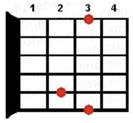
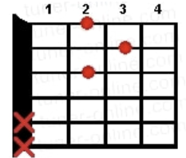
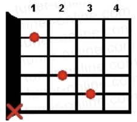
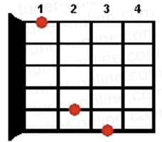

## EN EL TALLER DE NAZARET

<span style="color: red;">**Sol**</span>                                        <span style="color: red;">**Re**</span>                           <span style="color: red;">**Sol**</span>
En el taller de Nazaret, pequeño y pobre taller, 

<span style="color: red;">**Sol**</span>                                        <span style="color: red;">**Re**</span>                           <span style="color: red;">**Sol  Sol7 **</span>
en su labor está José y el niño quiere aprender 

<span style="color: red;">**Do**</span>                <span style="color: red;">**Sol**</span>               <span style="color: red;">**Re**</span>                            <span style="color: red;">**Sol**</span>
LABORA Y CANTA LA ESPOSA DEL CARPINTERO 

<span style="color: red;">**Do**</span>                     <span style="color: red;">**Sol**</span>               <span style="color: red;">**Re**</span>                       <span style="color: red;">**Sol**</span>
Y EL MUNDO ENTERO SONRIE Y CANTA TAMBIÉN 

<span style="color: red;">**Sol**</span>                                        <span style="color: red;">**Re**</span>                        <span style="color: red;">**Sol**</span>
En el taller de Nazaret, pequeño y pobre taller, 

<span style="color: red;">**Sol**</span>                                        <span style="color: red;">**Re**</span>                        <span style="color: red;">**Sol   Sol7 **</span> 
silencio y paz, amor y fe; Jesús, María y José. 

<span style="color: red;">**Do**</span>                <span style="color: red;">**Sol**</span>
LABORA Y CANTA ... 

<span style="color: red;">**Sol**</span>                                        <span style="color: red;">**Re**</span>                        <span style="color: red;">**Sol**</span>
En el taller de Nazaret, pequeño y pobre taller, 

<span style="color: red;">**Sol**</span>                                        <span style="color: red;">**Re**</span>                        <span style="color: red;">**Sol   Sol7 **</span> 
verás a Dios jugar, crecer, rezar y obedecer. 

<span style="color: red;">**Do**</span>                <span style="color: red;">**Sol**</span>
LABORA Y CANTA ....


### **Notas**

|           <span style="color: red;">**Sol**</span>           |           <span style="color: red;">**Re**</span>            |           <span style="color: red;">**Do**</span>            |          <span style="color: red;">**Sol7 **</span>          |
| :----------------------------------------------------------: | :----------------------------------------------------------: | :----------------------------------------------------------: | :----------------------------------------------------------: |
|  |  |  |  |

|  Do  |  Re  |  Mi  |  Fa  | Sol  |  La  |  Si  |
| :--: | :--: | :--: | :--: | :--: | :--: | :--: |
|  C   |  D   |  E   |  F   |  G   |  A   |  B   |

### **Tablatura de Bajo**

```text
Estribillo:
G|----------------|----------------|----------------|----------------|
D|----------------|----------------|----------------|----------------|
A|----3-3---------|----5-5---------|----5-5---------|----5-5---------|
E|3-3-----3-------|5-5-----5-------|5-5-----5-------|5-5-----5-------|
    En el taller     de Nazaret,     pequeño y pobre   taller,

Puente:
G|----------------|----------------|----------------|----------------|
D|----------------|----------------|----------------|----------------|
A|----5-5---------|----5-5---------|----5-5---------|-5-5-5-5--------|
E|5-5-----5-------|5-5-----5-------|5-5-----5-------|--------3-------|
    LABORA Y CANTA    LA ESPOSA      DEL CARPINTERO     Y EL MUNDO

Final:
G|----------------|----------------|----------------|----------------|
D|----------------|----------------|----------------|----------------|
A|----5-5---------|----5-5---------|----5-5---------|----5-5---------|
E|5-5-----5-------|5-5-----5-------|5-5-----5-------|5-5-----5-------|
    En el taller     de Nazaret,     pequeño y pobre   taller,
```

