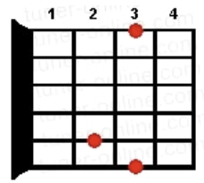

### VILLANCICO PERUANO

**Mi-**     **Sol** 			    **Mi-**

Esta noche Jesús ha nacido,

**Mi-**      **Sol** 			     **Mi-**

ESTA NOCHE JESUS HA NACIDO.

**Mi-** 	     **Sol** 	    **Si7** 		**Mi-**

Suena la música de la Noche Buena,

**Mi-** 	      **Sol** 	     **Si7** 		**Mi**

SUENA LA MÚSICA DE LA NOCHE BUENA.

**Mi-** 			**Sol**

Alma de mi canción sube al cielo del Perú,							

**Mi-**

para llenar de luz la blanca noche de Dios

**Mi-** 			  **Sol**

ALMA DE MI CANCIÓN SUBE AL CIELO DEL PERÚ,

​										   **Mi-**

PARA LLENAR DE LUZ LA BLANCA NOCHE DE DIOS

**Mi-** 		**Si7**

LA LA LA LA ....

**Mi-**      **Sol** 			   **Mi-**

Vibra pura cholito tu quena

**Mi-**       **Sol**  				  **Mi-**

VIBRA PURA CHOLITO TU QUENA

**Mi-**              **Sol**              **Si7**    	**Mi-**

Suena la música de la Noche Buena,

**Mi-**              **Sol**              **Si7**    	**Mi**

SUENA LA MUSICA DE LA NOCHE BUENA

**Mi-** 			**Sol**

Alma de mi canción...

**Mi-** 		**Si7**

LA LA LA LA ....

**Notas**

|           **Mi-**           |           **Sol**           |           **Si7**           |           **Mi**            |
| :----------------------------------------------------------: | :----------------------------------------------------------: | :----------------------------------------------------------: | :----------------------------------------------------------: |
|  |  |  |  |
